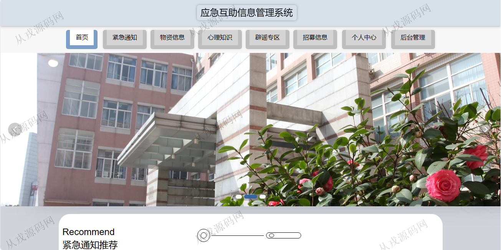
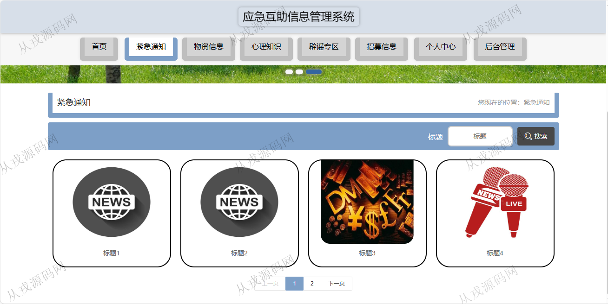
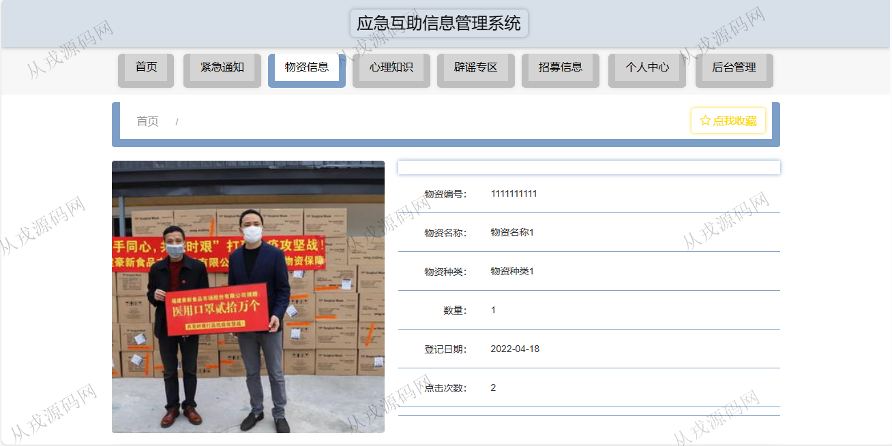
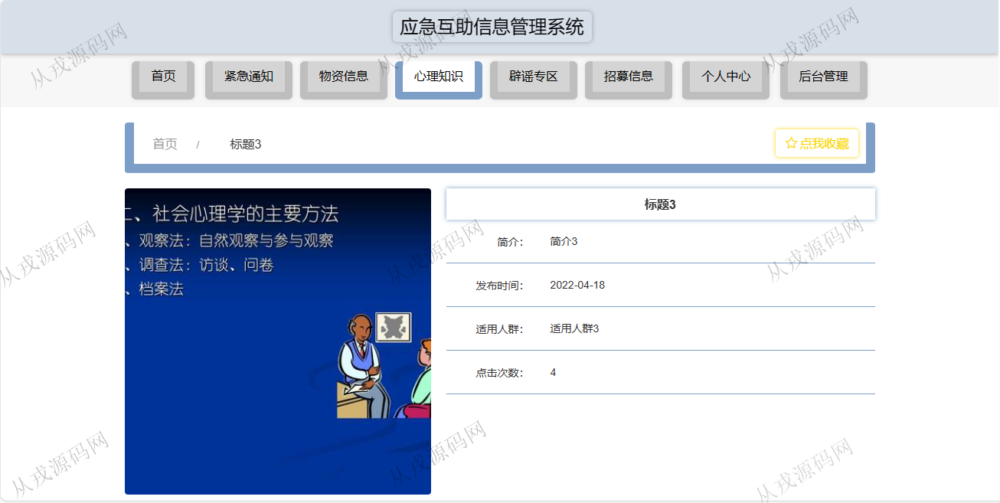
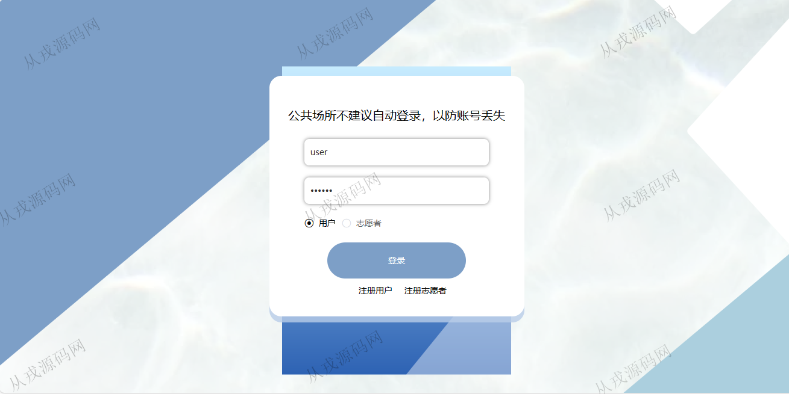
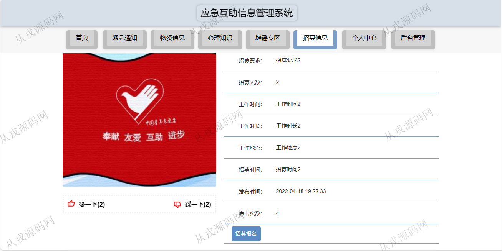
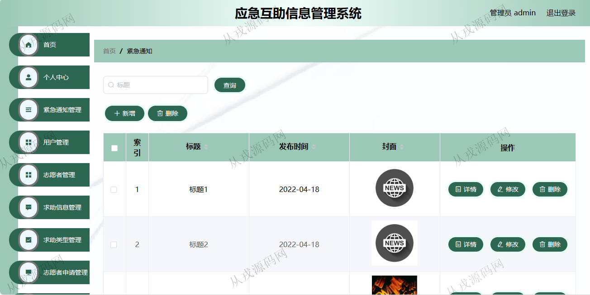
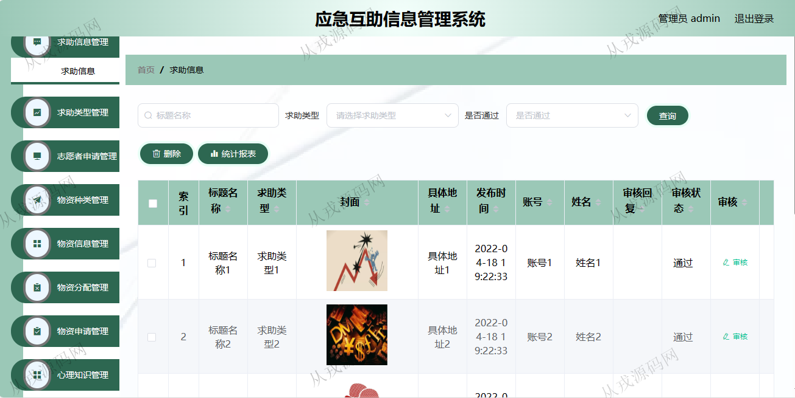
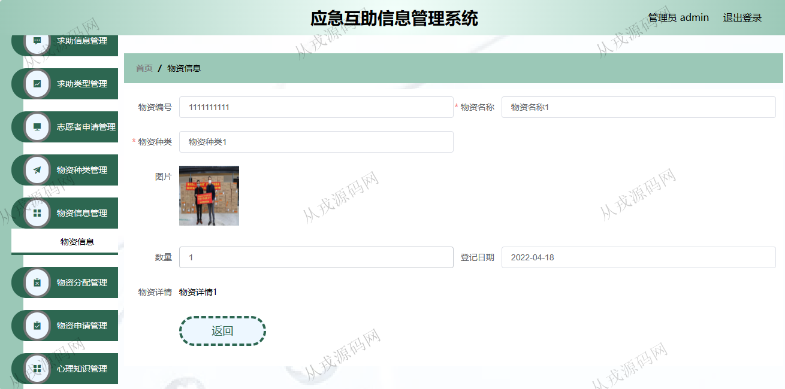

<h1 align="center">126.应急互助信息管理系统</h1>

- <b>完整代码获取地址：从戎源码网 ([https://armycodes.com/](https://armycodes.com/))</b>
- <b>技术探讨、资料分享，请加QQ群：692619798</b> 
- <b>作者微信：19941326836  QQ：952045282</b> 
- <b>承接计算机毕业设计、Java毕业设计、Python毕业设计、深度学习、机器学习</b>
- <b>选题+开题报告+任务书+程序定制+安装调试+论文+答辩ppt 一条龙服务</b>
- <b>所有选题地址 ([https://github.com/YuLin-Coder/AllProjectCatalog](https://github.com/YuLin-Coder/AllProjectCatalog)) </b>

## 项目介绍
基于ssm的应急互助信息管理系统：前端 vue、elementui，后端 maven、springmvc、spring、mybatis，角色分为管理员、用户；集成紧急通知，物资信息，心理知识，招募报名等功能于一体的系统。

## 功能介绍

### 用户

- 基本功能：登录、注册、退出
- 网站首页：主导航栏，轮播图，紧急通知推荐，紧急通知推荐，心理知识推荐，辟谣专区推荐，招募信息推荐
- 紧急通知：通知信息搜索，列表展示，通知信息详情
- 物资信息：物资信息搜索，列表展示，物资信息详情，物资在线申请
- 招募信息：招募信息搜索，列表展示，招募信息详情，招募在线报名，赞一下，踩一下
- 个人中心：个人信息查看与修改，我的收藏列表

### 管理员

- 个人中心：个人信息查看与修改，密码修改
- 紧急通知管理：紧急通知信息的增删改查
- 用户管理：用户信息的增删改查，头像修改上传
- 志愿者管理：志愿者信息的增删改查，照片上传
- 求助信信息管理：求助信息的列表查询，审核，统计报表
- 物资信息管理：物资信息的增删改查，物资分配
- 物资申请管理：前台用户申请的物资，后台管理员可以查询和审核操作
- 心理知识管理：心理知识的增删改查
- 医疗救助管理：医疗救助列表查询，详情，删除，审核
- 招募报名管理：用户在前台进行在线招募报名，后台管理员进行查看与审核

## 环境

- <b>IntelliJ IDEA 2021.3</b>

- <b>Mysql 5.7.26</b>

- <b>Tomcat 7.0.73</b>

- <b>JDK 1.8</b>

## 运行截图

